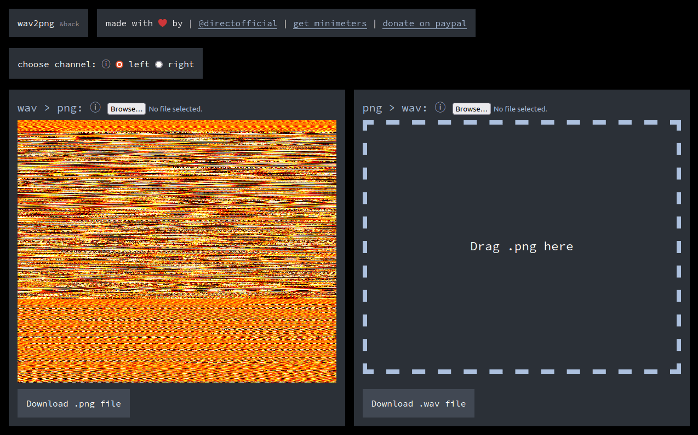

# wav2png

## what is wav2png?

wav2png is a really simple audio to png to audio converter i built as an experiment.

## how does it work?

it simply converts the audio to a color value and places that pixel on the image. 

the first sample is:  
x: 0, y: 0  
the second  
x: 1, y: 0

currently the stride is 3000 pixels. meaning the width of the image will never exceed that. we are limted by the size that the browser supports for canvas although there may be a more clever solution there.

## can i contribute?

sure. if you have an idea or found a bug and would like to add it submit a pr.